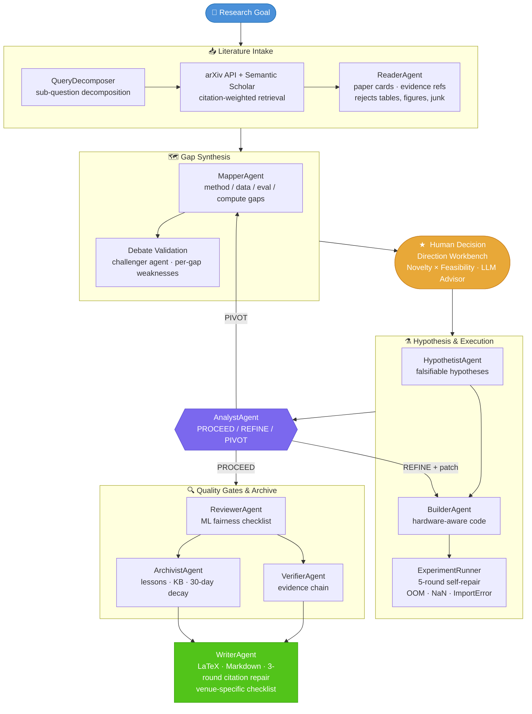

# ResearchOS

<p align="right">
  <a href="README.md"></a>
  <a href="README.zh-CN.md"></a>
</p>

> A multi-agent research workflow system that takes a research idea from literature retrieval to a reviewable paper draft — with structured human oversight at every critical decision point.

<p align="center">
  
  
  
  
  
  
</p>

---

## What problem does this solve?

Existing automated research systems (AI Scientist, AgentLaboratory, GPT-Researcher) are either:
- **Fully autonomous** with no structured human oversight — making decisions researchers can't audit or trust
- **Retrieval-only** — they find papers but can't design, run, or analyze experiments

ResearchOS is built around a different premise: **research is a human-AI collaboration, not a replacement**. Agents handle the high-volume mechanical work (literature screening, code generation, citation verification, result analysis). Humans stay in control at decisions that actually matter (research direction selection, experiment design approval, claim validation).

The result is a system where every artifact — every paper card, gap map, experiment spec, claim, and lesson — is traceable, verifiable, and reproducible.

---

## Architecture Overview



---

## Key Design Decisions

### 1. Three-layer skill architecture
Each agent is governed by three stacked layers:
- **Role prompt** (`prompts/roles/`) — defines what the role *is* and its professional responsibilities
- **Agent prompt** (`prompts/`) — specific behavioral rules for each task kind, including anti-patterns and hard rejection criteria
- **Skill file** (`skills/`) — concrete output templates, negative examples, and self-check criteria the LLM runs before returning output

This separation means skill quality can be improved independently from agent wiring, and skills can be reused across different underlying LLMs.

### 2. Database-mediated agent communication
Agents do not call each other directly. All inter-agent state flows through typed registries:

```
TaskRegistry → PaperCardRegistry → GapMapRegistry → FreezeRegistry → ArtifactRegistry
```

This makes the system fully inspectable (every intermediate artifact is readable at any time), recoverable (tasks can be retried from any checkpoint), and auditable (full provenance chain from raw input to published claim).

### 3. Structured human checkpoints
`human_select` is a first-class task kind — not a UI affordance or a fallback state. The pipeline *pauses* and will not continue until a human makes a verified decision. Additional checkpoints (`FREEZE_SPEC`, `AUDIT_RESULTS`) can be configured per-project as `required` or `optional`, and human approvals support conditional acceptance: a constraint entered in the UI is injected directly into the downstream task's context.

### 4. Self-evolving knowledge base
Lessons are not logs. After every task, `ArchivistAgent` evaluates whether the outcome contains a durable insight — one that is generalizable, evidence-backed, and reusable in a different context. Lessons are stored in a structured KB (4 categories: findings, decisions, literature, open questions) and decay after 30 days unless they keep getting retrieved. Each new task receives the top-5 most relevant prior lessons before executing, making the system measurably better on familiar research domains over time.

### 5. Experiment integrity gates
`ReviewerAgent` runs a domain-specific ML fairness checklist as blocking criteria before any result propagates to a paper draft:
- Same dataset split for method and all baselines?
- If data augmentation used — did the baseline receive identical augmentation budget?
- No test-set leakage into hyperparameter selection?
- Is the reported accuracy a cherry-picked epoch, or from a pre-declared stopping rule?
- For imbalanced datasets: is plain accuracy supplemented with a class-aware metric?

Claims failing these checks are blocked and returned with a concrete remediation note.

---

## Agent Catalog

| Agent | Role | Key responsibility |
|-------|------|--------------------|
| **ReaderAgent** | Librarian | Literature screening → structured paper cards with evidence refs |
| **MapperAgent** | Synthesizer | Paper cards → gap clusters with novelty/feasibility scoring |
| **HypothetistAgent** | Hypothesist | Gap → falsifiable, bounded, testable hypotheses |
| **BuilderAgent** | Executor | Spec → runnable, hardware-aware Python experiment code |
| **AnalystAgent** | Analyst | Run results → PROCEED / REFINE / PIVOT with numeric justification |
| **ReviewerAgent** | Reviewer | Artifacts → blocking/warning review with ML fairness checklist |
| **VerifierAgent** | Verifier | Claims → evidence chain verification with scope declaration |
| **WriterAgent** | Publisher | Frozen evidence → paper sections / full draft with citation repair |
| **ArchivistAgent** | Archivist | Runs → durable lessons + structured knowledge base entries |
| **BranchManagerAgent** | — | Multi-branch experiment coordination, scoring, and pruning |

---

## Tech Stack

| Layer | Technology |
|-------|-----------|
| Backend runtime | Python 3.11, FastAPI, SQLAlchemy |
| Storage | SQLite (local) / PostgreSQL (production) |
| Task queue | Celery + Redis |
| Frontend | React 18, TypeScript, Vite, Lucide |
| LLM integration | Claude CLI, Codex CLI, Gemini CLI (subprocess, no direct API) |
| Paper retrieval | arXiv API, Semantic Scholar API |
| Containerization | Docker Compose |
| CI | GitHub Actions |
| Package manager | uv |

---

## Quick Start

**Requirements:** Python 3.11+, [uv](https://docs.astral.sh/uv/), Node.js 18+

```bash
# Install dependencies
uv sync --dev
cd frontend && npm install && cd ..

# Initialize local database
uv run researchos --db-path data/researchos.db init-db

# Launch (starts both API on :8000 and frontend on :5173)
uv run researchos web
```

Open `http://127.0.0.1:5173` — the UI will guide you through starting your first research project from a plain-language goal.

**With a real LLM provider** (requires the corresponding CLI installed and authenticated):

```bash
export RESEARCHOS_PROVIDER=claude          # or codex / gemini
export RESEARCHOS_PROVIDER_MODEL=sonnet
export RESEARCHOS_WORKSPACE_ROOT=$(pwd)
```

**For demos and CI** (deterministic, zero API keys):

```bash
export RESEARCHOS_PROVIDER=local
export RESEARCHOS_PROVIDER_MODEL=deterministic-reader
```

Override ports if needed:

```bash
uv run researchos web --port 8010 --frontend-port 5180
```

---

## Guided Research Workflow

The web UI is built around the research pipeline itself, not the underlying data model.

```
1. Enter a research goal in plain language
   ─────────────────────────────────────────────────────────────────
   System decomposes the goal into complementary search sub-queries,
   fetches papers from arXiv + Semantic Scholar (citation-weighted),
   and generates structured paper cards automatically.

2. Gap analysis with adversarial debate
   ─────────────────────────────────────────────────────────────────
   MapperAgent clusters the evidence into research gaps.
   A challenger ReviewerAgent debates each candidate gap before it
   surfaces — the weaknesses are displayed alongside each gap so the
   human decision is better informed.

3. ★ Human Decision: Direction Workbench
   ─────────────────────────────────────────────────────────────────
   - Novelty × Feasibility scatter matrix
   - Per-gap debate weaknesses shown inline
   - LLM advisor chat for deep feasibility discussion
   - Optional: attach constraints to approval ("use FGSM not PGD")

4. Autopilot continues to the next checkpoint
   ─────────────────────────────────────────────────────────────────
   hypothesis generation → spec freeze → experiment → analysis
   Each stage can be configured as required (always pause) or
   optional (auto-advance if confidence is high).

5. Writer produces a draft
   ─────────────────────────────────────────────────────────────────
   LaTeX or Markdown, with 3-round citation verification,
   venue-specific checklist (NeurIPS/ICLR), and explicit
   limitation sections.
```

---

## Project Structure

```
ResearchOS/
├── app/
│   ├── agents/          # 10 specialized agents (reader, mapper, builder, …)
│   ├── api/             # FastAPI routers and schemas
│   ├── cli.py           # CLI entrypoint (uv run researchos)
│   ├── core/            # Enums, config, pipeline stage definitions
│   ├── db/              # SQLAlchemy models, Alembic migrations
│   ├── providers/       # Claude / Codex / Gemini / Local CLI wrappers
│   ├── routing/         # Provider health, routing policy, fallback chains
│   ├── roles/           # Role contracts, bindings, registry
│   ├── services/        # All domain services (gap maps, lessons, KB, …)
│   ├── skills/          # Skill specs and registry
│   └── tools/           # arXiv, Semantic Scholar, experiment runner, …
├── frontend/
│   └── src/
│       ├── components/  # OverviewTab, OperationsTab, RegistryTab, CreateTab
│       └── App.tsx
├── prompts/             # Agent prompts + role prompts + advisor prompts
├── skills/              # SKILL.md files per role (templates, anti-patterns)
├── registry/            # Durable JSONL state (paper cards, gaps, lessons, …)
├── tests/
│   ├── unit/
│   └── integration/
└── docker-compose.yml
```

---

## Data Model

ResearchOS treats research artifacts as typed, versioned, first-class objects — not as chat history or flat files.

| Object | What it captures |
|--------|-----------------|
| `PaperCard` | Problem, method, strongest result, datasets, metrics, evidence refs |
| `GapMap` | Clustered gaps with novelty/feasibility scores and per-gap debate weaknesses |
| `TopicFreeze` | Immutable snapshot of the selected research direction and rationale |
| `SpecFreeze` | Immutable experiment spec: hypothesis, baselines, datasets, metrics, success/failure criteria |
| `RunManifest` | Full execution record: config, seed, dataset snapshot, artifacts, metrics |
| `Claim` | Empirical assertion tied to a specific run with risk level and human approval state |
| `Lesson` | Durable insight from past tasks — evidence-backed, with hit count and 30-day decay |
| `KnowledgeBase` | Cross-project structured knowledge: findings, decisions, literature, open questions |

---

## Selected API Endpoints

```
POST  /guide/start                    Start a project from a plain-language research goal
POST  /guide/discuss-direction        LLM advisor discussion about a gap candidate
POST  /guide/adopt-direction          Lock in a research direction and create topic freeze
POST  /projects/{id}/autopilot        Advance project to the next human checkpoint

GET   /projects/{id}/dashboard        Full project state snapshot
GET   /projects/{id}/events/stream    SSE stream for real-time task status updates
GET   /routing/system                 Current provider health and routing policy
GET   /providers/health               Per-provider status, cooldowns, and failure counts

POST  /tasks/{id}/dispatch            Manually dispatch a queued task
GET   /artifacts/{id}/inspect         Inspect artifact content and metadata
GET   /audit/summary                  Audit findings across all claims and runs
GET   /verifications/summary          Evidence verification status across all projects
```

---

## Running Tests

```bash
# Unit tests
uv run pytest tests/unit -v

# Integration tests (deterministic local provider, no API keys needed)
uv run pytest tests/integration -v

# Compile check + frontend build (mirrors CI)
uv run python -m compileall app
cd frontend && npm run build
```

---

## Production Deployment

```bash
# Full stack: FastAPI + PostgreSQL + Redis + Celery worker
docker compose up -d --build

# Health check
curl http://localhost:8000/health
```

The production stack swaps SQLite for PostgreSQL and adds a Celery worker for async task dispatch. The API surface is identical to the local dev setup.

---

## Comparison with Related Systems

| Feature | ResearchOS | AI Scientist v2 | GPT-Researcher | AgentLaboratory |
|---------|:---:|:---:|:---:|:---:|
| Structured human checkpoints | ✅ | ❌ | ❌ | ⚠️ |
| Experiment self-repair loop | ✅ | ⚠️ | ❌ | ✅ |
| Cross-project knowledge accumulation | ✅ | ❌ | ❌ | ❌ |
| Citation verification + repair | ✅ | ⚠️ | ❌ | ❌ |
| ML fairness review gates | ✅ | ❌ | ❌ | ⚠️ |
| Gap debate / adversarial validation | ✅ | ❌ | ❌ | ❌ |
| Web UI for operators | ✅ | ❌ | ❌ | ❌ |
| Multi-provider routing + fallback | ✅ | ✅ | ✅ | ⚠️ |
| Full artifact provenance chain | ✅ | ⚠️ | ❌ | ⚠️ |

---

## Roadmap

- [ ] Hypothesist wired into main dispatch flow (currently designed, not dispatched)
- [ ] Branch-tree experiment exploration (tree-search style, multiple parallel branches)
- [ ] LaTeX compilation to PDF
- [ ] Cross-project knowledge graph visualization
- [ ] Experiment result comparison dashboard
- [ ] JSONL → SQLite primary storage migration for all registries

---

*Python 3.11 · FastAPI · React 18 · SQLAlchemy · Multi-provider LLM routing*
